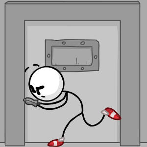

# Appimage Recipes
Some AppImage recipes for software that will probably never have a native version of Linux. Some software appears to be abandonware, some is flash applications (an AppImage is required because most browsers no longer support Flash)

<table>
  <tr>
    <td><b>Icon</b></td>
    <td><b>Name</b></td>
    <td><b>Description</b></td>
  </tr>
  <tr>
    <td></td>
    <td>Fleeing The Complex</td>
    <td>In Fleeing the Complex, you need to make quick decisions in life and death situations. You can choose to sneak through the guards, go through checkpoints, or pick up a gun and fight.</td>
    <td><a href="https://www.stickpage.com/fleeingthecomplexgame.shtml">Author website</b></td>
    <td><a href="../../releases/download/download/Fleeing_The_Complex-x86_64.AppImage">Download</b></td>
</tr>
</table>
